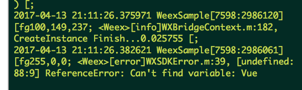
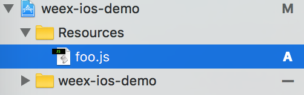

# Weex-IOS开发

## 安装CocoaPods

```
sudo gem install cocoapods

```
安装完后不能马上使用，因为pod里面的资源不是最新的。需要更新

```
pod setup

```
---

这步很重要，一开始就是因为缺失这一步，只拿到了WeexSDK (0.6.1),导致加载vue组件失败，还一直找不到原因，绕了很多弯路！



---

## 安装依赖

新建一个xcode项目，在项目根目录调用`pod init`创建一个新的Profile文件，并编辑

```
# Weex支持的最低版本是iOS7.0.
platform :ios, '7.0'

target 'weex-ios-demo' do
    pod 'WeexSDK', '0.10.0'
    pod 'SDWebImage', '3.7.5'
end

```
运行`pod install` 安装依赖。

安装完成关闭原来的Xcode项目，打开新生成的`xxx.xcworkspace`

## 开发环境

### 实现图片加载

感谢仓库[^1]的作者，参照它的代码我用[SDWebImage](https://github.com/rs/SDWebImage)实现了图片异步加载

```
- (id<WXImageOperationProtocol>)downloadImageWithURL:(NSString *)url imageFrame:(CGRect)imageFrame userInfo:(NSDictionary *)userInfo completed:(void(^)(UIImage *image,  NSError *error, BOOL finished))completedBlock
{
    if ([url hasPrefix:@"//"]) {
        url = [@"http:" stringByAppendingString:url];
    }
    return (id<WXImageOperationProtocol>)[[SDWebImageManager sharedManager] downloadImageWithURL:[NSURL URLWithString:url] options:0 progress:^(NSInteger receivedSize, NSInteger expectedSize) {
        
    } completed:^(UIImage *image, NSError *error, SDImageCacheType cacheType, BOOL finished, NSURL *imageURL) {
        if (completedBlock) {
            completedBlock(image, error, finished);
        }
    }];
}
```

### 初始化环境

编辑`AppDelegate.m`

```
#import "AppDelegate.h"
#import <WeexSDK/WXSDKEngine.h> //SDK开放的绝大多数接口都在此有声明。
#import <WeexSDK/WXLog.h> //控制Log输出的级别，包括Verbose、Debug、Info、Warning、Error，开发者可以按需来设置输出级别。
#import <WeexSDK/WXDebugTool.h> //weex提供的对外调试工具。
#import <WeexSDK/WXAppConfiguration.h> //使用weex开发的业务性配置。


@interface AppDelegate ()

@end

@implementation AppDelegate

- (BOOL)application:(UIApplication *)application didFinishLaunchingWithOptions:(NSDictionary *)launchOptions {
    // 业务配置，非必需
    [WXAppConfiguration setAppGroup:@"AliApp"];
    [WXAppConfiguration setAppName:@"WeexDemo"];
    [WXAppConfiguration setAppVersion:@"1.0.0"];
    
    // 初始化SDK环境
    [WXSDKEngine initSDKEnviroment];
    
    // 设置Log输出等级：调试环境默认为Debug，正式发布会自动关闭。
    [WXLog setLogLevel:WXLogLevelAll];
    // 注册图片加载
    [WXSDKEngine registerHandler:[ImageAdapter new] withProtocol:@protocol(WXImgLoaderProtocol)];
    
//    // 注册自定义module和component，非必需
//    [WXSDKEngine registerComponent:@"MyView" withClass:[MyViewComponent class]];
//    [WXSDKEngine registerModule:@"event" withClass:[WXEventModule class]];
//    
//    // 注册协议的实现类，非必需
//    [WXSDKEngine registerHandler:[WXNavigationDefaultImpl new] withProtocol:@protocol(WXNavigationProtocol)];
    return YES;
}

```

### 渲染Weex实例

编辑`ViewController.h`

```
/**
 * WXSDKInstance，简单来说，就是weex渲染的实例对象。它提供给开发者诸多跟页面渲染相关的接口，
 * 包括renderWithURL、refreshInstance以及destroyInstance等，提供了几个比较重要的回调接口，
 * 方便开发者根据不同的业务场景去处理他们的逻辑，如onfailed，还提供了性能监控相关的接口。
 */
#import <WeexSDK/WXSDKInstance.h>


@interface ViewController : UIViewController

//WXSDKInstance属性
@property (nonatomic, strong) WXSDKInstance *instance;
//URL属性(用于指定加载js的URL,一般声明在接口中,我们为了测试方法写在了类扩展中.)
@property (nonatomic, strong) NSURL *url;
//Weex视图
@property (weak, nonatomic) UIView *weexView;

@end

```
编辑`ViewController.m`

```
#import "ViewController.h"


@interface ViewController ()

@end


@implementation ViewController

- (NSURL *)url {
    if (!_url) {
        _url =  [[NSBundle mainBundle] URLForResource:@"foo"   withExtension:@"js"];
    }
    return _url;
}

- (void)viewDidLoad {
    [super viewDidLoad];
    // 创建WXSDKInstance对象
    _instance = [[WXSDKInstance alloc] init];
    // 设置weexInstance所在的控制器
    _instance.viewController = self;
    // 根据weex对instance的设计规范，需要渲染中知道最外层body的位置和尺寸。这个frame值的设置，跟最终在回调中获取的view.frame一致。
    // 当然，在很多场景下，仅需要在一个native页面的局部渲染weex区块。很简单，您只需要将instance.frame设置为目标区块的位置尺寸即可。
    _instance.frame = self.view.frame; //必需

    // 设置weexInstance用于渲染的`js`的URL路径(后面说明)
    [_instance renderWithURL:self.url options:@{@"bundleUrl":[self.url absoluteString]} data:nil];
    // 为了避免循环引用声明一个弱指针的`self`
    __weak typeof(self) weakSelf = self;
    // 设置weexInstance创建完毕回调
    _instance.onCreate = ^(UIView *view) {
        weakSelf.weexView = view;
        [weakSelf.weexView removeFromSuperview];
        [weakSelf.view addSubview:weakSelf.weexView];
    };
    // 设置`weexInstance`出错的回调
    _instance.onFailed = ^(NSError *error) {
        //process failure
        NSLog(@"处理失败:%@",error);
    };
    //设置渲染完成的回调
    _instance.renderFinish = ^ (UIView *view) {
        //process renderFinish
        NSLog(@"渲染完成");
    };
}


- (void)didReceiveMemoryWarning {
    [super didReceiveMemoryWarning];
    // Dispose of any resources that can be recreated.
}

- (void)dealloc {
    //  销毁WXSDKInstance实例
    [self.instance destroyInstance];
}

```


### 添加JSBundle文件

添加用于本地加载的`foo.js`文件



### 运行调试

直接可以连接真机或者模拟器运行查看效果

## 参考
- [Week IOS SDK 集成指南](https://open.taobao.com/doc2/detail?spm=a219a.7629140.0.0.tFddsV&&docType=1&articleId=104829)
- [weex-iOS集成](http://www.jianshu.com/p/2ea29d381c60)

[^1]:[weex-vue](https://github.com/wangwei123/weex-vue)